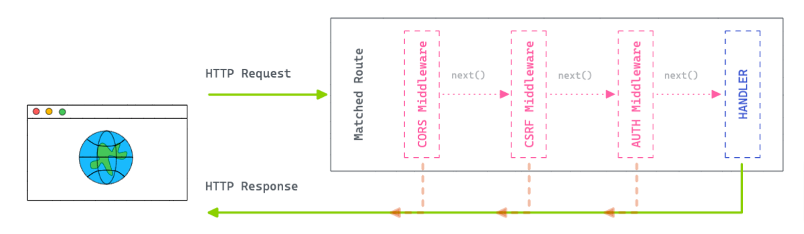

<br>
<div align="center">
    
    <p align="center">
        To create distributed systems in a simple, elegant and safe way.
    </p>    
</div>

<a href="https://github.com/syntax-framework/syntax"></a>

**chain** is part of the [Syntax Framework](https://github.com/syntax-framework/syntax)

---

Chain is a core library that seeks to provide all the necessary machinery to create distributed systems in a simple,
elegant and safe way.

## Feature Overview

- Optimized HTTP Router middleware
- Crypto-related functionality
    - **KeyGenerator**: PBKDF2 (Password-Based Key Derivation Function 2). It can be used to derive a number of keys for
      various purposes from a given secret. This lets applications have a single secure secret, but avoid reusing
      that key in multiple incompatible contexts.
    - **MessageVerifier**: makes it easy to generate and verify messages which are signed to prevent tampering.
    - **MessageEncryptor** is a simple way to encrypt values which get stored somewhere you don't trust.
- Realtime Publisher/Subscriber service.
- Socket & Channels: A socket implementation that multiplexes messages over channels.

## Installation

```
go get github.com/syntax-framework/chain
```

## Router



**chain** has a lightweight high performance HTTP request router (also called *multiplexer* or just *mux* for short)
for [Go](https://golang.org/). In contrast to the [default mux](https://golang.org/pkg/net/http/#ServeMux) of
Go's `net/http` package, this router supports variables in the routing pattern and matches against the request method.
It also scales better.

- Optimized HTTP router which smartly prioritize routes
- Build robust and scalable RESTful APIs
- Extensible Middleware framework
- Handy functions to send variety of HTTP responses
- Centralized HTTP error handling

```go
package main

import (
	"github.com/syntax-framework/chain"
	"log"
	"net/http"
)

func main() {
	router := chain.New()

	// Middleware
	router.Use(func(ctx *chain.Context, next func() error) error {
		println("first middleware")
		return next()
	})

	router.Use("GET", "/*", func(ctx *chain.Context) {
		println("second middleware")
	})

	// Handler
	router.GET("/", func(ctx *chain.Context) {
		ctx.Write([]byte("Hello World!"))
	})

	// Grouping
	v1 := router.Group("/v1")
	{
		v1.GET("/users", func(ctx *chain.Context) {
			ctx.Write([]byte("[001]"))
		})
	}

	v2 := router.Group("/v2")
	{
		v2.GET("/users", func(ctx *chain.Context) {
			ctx.Write([]byte("[002]"))
		})
	}

	if err := http.ListenAndServe("localhost:8080", router); err != nil {
		log.Fatalf("ListenAndServe: %v", err)
	}
}
```

## PubSub


Realtime Publisher/Subscriber service.

You can use the functions in this module to subscribe and broadcast messages:

```go
package main

import (
	"fmt"
	"github.com/syntax-framework/chain/pubsub"
	"time"
)

type MyDispatcher struct {
}

func (d *MyDispatcher) Dispatch(topic string, message any) {
	println(fmt.Sprintf("New Message. Topic: %s, Content: %v", topic, message))
}

func main() {

	dispatcher := &MyDispatcher{}

	pubsub.Subscribe("user:123", dispatcher)

	pubsub.Broadcast("user:123", map[string]any{
		"Event": "user_update",
		"Payload": map[string]any{
			"Id":   6,
			"Name": "Gabriel",
		},
	})

	pubsub.Broadcast("user:123", "Message 2")

	// await
	<-time.After(time.Second)

	pubsub.Unsubscribe("user:123", dispatcher)

	pubsub.Broadcast("user:123", "Message Ignored")
}
```

### Adapters

Chain PubSub was designed to be flexible and support multiple backends.

By default, the chain is configured with just
the [LocalAdapter](https://github.com/syntax-framework/chain/blob/main/pubsub/pubsub_local_adapter.go).

## Socket & Channels

## Crypto

### KeyGenerator

KeyGenerator uses PBKDF2 (Password-Based Key Derivation Function 2), part of PKCS #5 v2.0 (Password-Based
Cryptography Specification).

It can be used to derive a number of keys for various purposes from a given secret. This lets applications have a
single secure secret, but avoid reusing that key in multiple incompatible contexts.

The returned key is a binary. You may invoke functions in the `base64` module, such as
`base64.StdEncoding.EncodeToString()`, to convert this binary into a textual representation.

See http://tools.ietf.org/html/rfc2898#section-5.2

The `KeyGenerator.Generate` method returns a derived key suitable for use.

```go
secretKeyBase := []byte("ZcbD0D29eYsGq89QjirJbPkw7Qxwxboy")

cookieSalt := []byte("encrypted cookie")
signedCookieSalt := []byte("signed encrypted cookie")

secret := chain.KeyGenerator.Generate(secretKeyBase, cookieSalt, 1000, 32, "sha256")
signSecret := chain.KeyGenerator.Generate(secretKeyBase, signedCookieSalt, 1000, 32, "sha256")

println(base64.StdEncoding.EncodeToString(secret))
// output: hpMv01EYLPyGVlV5cBOJR0eK6HNSHO+zHKMmZp2Ezqw=

println(base64.StdEncoding.EncodeToString(signSecret))
// output: y3/r20tnfIWkRZr4HlaC3GAM4LsvS8KnF0JuIi/G/RQ=
```

### MessageVerifier

`MessageVerifier` makes it easy to generate and verify messages which are signed to prevent tampering.

For example, the [cookie store](https://github.com/syntax-framework/chain/blob/main/middlewares/session/store_cookie.go)
uses this verifier to send data to the client. The data can be read by the client, but cannot be tampered with.

The message and its verification are base64url encoded and returned to you.

This is useful for cases like remember-me tokens and auto-unsubscribe links where the session store isn't suitable or
available.

```go
message := []byte("This is content")
secret := []byte("ZcbD0D29eYsGq89QjirJbPkw7Qxwxboy")

signed := chain.MessageVerifier.Sign(message, secret, "sha256")
println(signed)
// output: SFMyNTY.VGhpcyBpcyBjb250ZW50.m-DwbnWabePV8K7-lUNhS8c6gWnwpQcAAhaQ6V2fwA8

verified, _ := chain.MessageVerifier.Verify([]byte(signed), secret)
println(string(verified))
// output: This is content
```

#### Decoding using javascript

MessageVerifier does not encrypt your data, it only signs it. In this way, the signed message can be easily read via
javascript, making it an excellent mechanism to share data with the frontend with the guarantee that the value cannot be
modified.

```javascript
let signed = 'SFMyNTY.VGhpcyBpcyBjb250ZW50.m-DwbnWabePV8K7-lUNhS8c6gWnwpQcAAhaQ6V2fwA8';
let content = atob(signed.split('.')[1])
console.log(content); // This is content
```

### MessageEncryptor

`MessageEncryptor` is a simple way to encrypt values which get stored somewhere you don't trust.

The encrypted key is are base64url encoded and returned to you.

This can be used in situations similar to the `MessageVerifier`, but where you don't want users to be able to determine
the value of the payload.

The current algorithm used is AES-GCM-128.

```go
data := []byte("This is content")

secretKeyBase := []byte("ZcbD0D29eYsGq89QjirJbPkw7Qxwxboy")

cookieSalt := []byte("encrypted cookie")
signedCookieSalt := []byte("signed encrypted cookie")

secret := chain.KeyGenerator.Generate(secretKeyBase, cookieSalt, 1000, 32, "sha256")
signSecret := chain.KeyGenerator.Generate(secretKeyBase, signedCookieSalt, 1000, 32, "sha256")

encrypted, _ := chain.MessageEncryptor.Encrypt(data, secret, signSecret)
println(encrypted)
// output: QTEyOEdDTQ.6a38RGT313YpFoSkixjo_dJAyUxrDMq2SCG0RbpV27vuGkC4XCDKt8L2h68.QBekP9B7ousP7nEhpsvabIR8qZTmdiZFyQ9MZbJSvAOo2pPFlT_v0d57zw

decrypted, _ := chain.MessageEncryptor.Decrypt([]byte(encrypted), secret, signSecret)
println(string(decrypted))
// output: This is content
```

> Note that, unlike `MessageVerifier`, the result (`encrypted`) cannot be read. Only in possession of `secret`
> and `signSecred` is it possible to access the original content.


