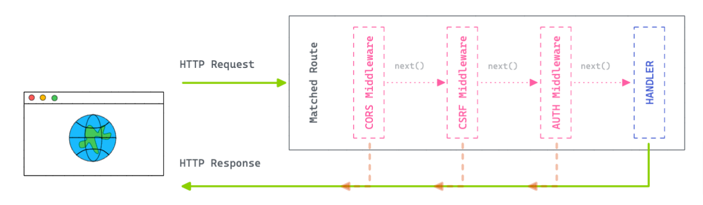
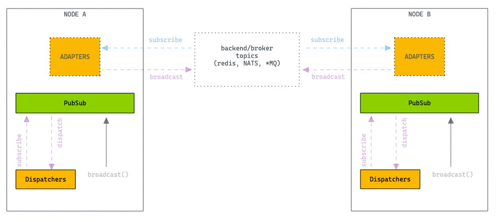
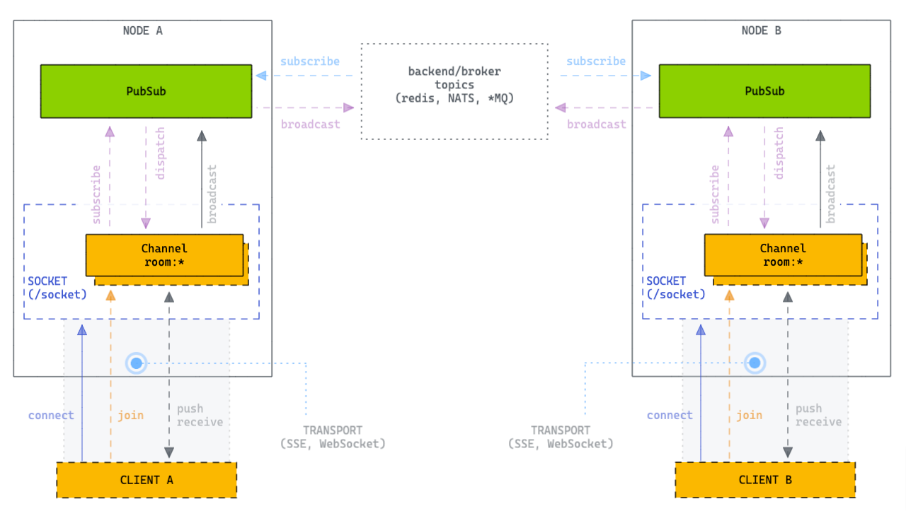

<br>
<div align="center">
    
    <p align="center">
        A high-performance, production-ready HTTP router for Go with built-in crypto, pub/sub, and real-time socket support.
    </p>

[](https://go.dev/)
[](https://pkg.go.dev/github.com/nidorx/chain)
[](LICENSE)

</div>

---

**Chain** is a lightweight, high-performance HTTP router and distributed systems toolkit for Go. It provides an optimized routing engine with middleware support, cryptographic utilities, a cluster-aware pub/sub system, and real-time WebSocket-like channels over SSE.

## Features

- **Optimized HTTP Router** — Segment-based routing with static route caching, wildcard support, and priority-based matching
- **Middleware System** — Flexible middleware chain with route-specific and global scoping
- **Data Binding** — Automatic binding for JSON, XML, Form, Query, Path, and Header parameters with validation
- **Cryptographic Utilities** — AES-GCM encryption, PBKDF2 key derivation, HMAC message signing, and key rotation via Keyring
- **Pub/Sub System** — Cluster-aware publish/subscribe with optional encryption and compression
- **Socket & Channels** — Real-time multiplexed communication over Server-Sent Events (SSE)
- **Session Management** — Cookie-based sessions with optional encryption and signing

## Installation

```sh
go get github.com/nidorx/chain
```

**Requirements:** Go 1.25 or later.

## Quick Start

### Minimal Server

```go
package main

import (
	"log"
	"net/http"

	"github.com/nidorx/chain"
)

func main() {
	r := chain.New()

	r.GET("/", func(ctx *chain.Context) error {
		ctx.Json(map[string]string{"message": "Hello, Chain!"})
		return nil
	})

	log.Println("Server starting on :8080")
	log.Fatal(http.ListenAndServe(":8080", r))
}
```

### With Middleware and Route Groups

```go
package main

import (
	"log"
	"net/http"
	"time"

	"github.com/nidorx/chain"
)

func main() {
	r := chain.New()

	// Global logging middleware
	r.Use(func(ctx *chain.Context, next func() error) error {
		start := time.Now()
		err := next()
		log.Printf("[%d] %s %s — %v", ctx.GetStatus(), ctx.Method(), ctx.URL().Path, time.Since(start))
		return err
	})

	// API v1 group with auth middleware
	api := r.Group("/api")
	api.Use(func(ctx *chain.Context, next func() error) error {
		if ctx.GetHeader("Authorization") == "" {
			ctx.Unauthorized(map[string]string{"error": "missing authorization"})
			return nil
		}
		return next()
	})

	v1 := api.Group("/v1")
	v1.GET("/users", listUsers)
	v1.POST("/users", createUser)
	v1.GET("/users/:id", getUser)

	log.Fatal(http.ListenAndServe(":8080", r))
}

func listUsers(ctx *chain.Context) error   { ctx.Json(map[string]string{"action": "list"}); return nil }
func createUser(ctx *chain.Context) error  { ctx.Json(map[string]string{"action": "create"}); return nil }
func getUser(ctx *chain.Context) error     { ctx.Json(map[string]string{"id": ctx.GetParam("id")}); return nil }
```

### With Data Binding and Validation

```go
package main

import (
	"log"
	"net/http"

	"github.com/nidorx/chain"
)

type CreateUser struct {
	Name  string `json:"name"  binding:"required,min=3"`
	Email string `json:"email" binding:"required,email"`
}

func main() {
	r := chain.New()

	r.POST("/users", func(ctx *chain.Context) error {
		var u CreateUser
		if err := ctx.BindJSON(&u); err != nil {
			return err // automatically returns 400 with validation details
		}
		ctx.Created(u)
		return nil
	})

	log.Fatal(http.ListenAndServe(":8080", r))
}
```

## Router



**chain** has a lightweight high performance HTTP request router (also called *multiplexer* or just *mux* for short)
for [Go](https://golang.org/). In contrast to the [default mux](https://golang.org/pkg/net/http/#ServeMux) of
Go's `net/http` package, this router supports variables in the routing pattern and matches against the request method.
It also scales better.

- Optimized HTTP router which smartly prioritize routes
- Build robust and scalable RESTful APIs
- Extensible Middleware framework
- Handy functions to send variety of HTTP responses
- Centralized HTTP error handling

```go
package main

import (
	"github.com/nidorx/chain"
	"log"
	"net/http"
)

func main() {
	router := chain.New()

	// Middleware
	router.Use(func(ctx *chain.Context, next func() error) error {
		println("first middleware")
		return next()
	})

	router.Use("GET", "/*", func(ctx *chain.Context) {
		println("second middleware")
	})

	// Handler
	router.GET("/", func(ctx *chain.Context) {
		ctx.Write([]byte("Hello World!"))
	})

	// Grouping
	v1 := router.Group("/v1")
	{
		v1.GET("/users", func(ctx *chain.Context) {
			ctx.Write([]byte("[001]"))
		})
	}

	v2 := router.Group("/v2")
	{
		v2.GET("/users", func(ctx *chain.Context) {
			ctx.Write([]byte("[002]"))
		})
	}

	if err := http.ListenAndServe("localhost:8080", router); err != nil {
		log.Fatalf("ListenAndServe: %v", err)
	}
}
```

### More about Router

- [Router docs](/docs/ROUTER.md)
- [`/examples/router`](/examples/router)

## PubSub



Realtime Publisher/Subscriber service.

You can use the functions in this module to subscribe and broadcast messages:

```go
package main

import (
	"fmt"
	"github.com/nidorx/chain"
	"github.com/nidorx/chain/pubsub"
	"time"
)

type MyDispatcher struct {
}

func (d *MyDispatcher) Dispatch(topic string, message any, from string) {
	println(fmt.Sprintf("New Message. Topic: %s, Content: %s", topic, message))
}

func main() {

	dispatcher := &MyDispatcher{}
	serializer := &chain.JsonSerializer{}

	pubsub.Subscribe("user:123", dispatcher)

	bytes, _ := serializer.Encode(map[string]any{
		"Event": "user_update",
		"Payload": map[string]any{
			"Id":   6,
			"Name": "Gabriel",
		},
	})
	pubsub.Broadcast("user:123", bytes)
	pubsub.Broadcast("user:123", []byte("Message 2"))

	// await
	<-time.After(time.Millisecond * 10)

	pubsub.Unsubscribe("user:123", dispatcher)

	pubsub.Broadcast("user:123", []byte("Message Ignored"))

	// await
	<-time.After(time.Millisecond * 10)
}
```

### More about PubSub

- [PubSub docs](/docs/PUBSUB.md)
- [`/examples/pubsub`](/examples/pubsub)

## Socket & Channels



A socket implementation that multiplexes messages over channels.

Once connected to a socket, incoming and outgoing events are routed to channels. The incoming client data is routed to
channels via transports. It is the responsibility of the socket to tie transports and channels together.

Chain ships with a JavaScript implementation that interacts with backend and can be used as reference for those
interested in implementing custom clients.

Server

```go
package main

import (
	"github.com/nidorx/chain"
	"github.com/nidorx/chain/socket"
	"log"
	"net/http"
)

func main() {
	router := chain.New()

	router.Configure("/socket", AppSocket)

	if err := http.ListenAndServe(":8080", router); err != nil {
		log.Fatalf("ListenAndServe: %v", err)
	}
}

var AppSocket = &socket.Handler{
	Channels: []*socket.Channel{
		socket.NewChannel("chat:*", chatChannel),
	},
}

func chatChannel(channel *socket.Channel) {

	channel.Join("chat:lobby", func(params any, socket *socket.Socket) (reply any, err error) {
		return
	})

	channel.HandleIn("my_event", func(event string, payload any, socket *socket.Socket) (reply any, err error) {
		reply = "Ok"

		socket.Push("other_event", map[string]any{"value": 1})
		return
	})
}
```

Client (javascript)

```javascript
const socket = chain.Socket('/socket')
socket.connect()

const channel = socket.channel("chat:lobby", {param1: 'foo'})
channel.join()

channel.push('my_event', {name: $inputName.value})
    .on('ok', (reply) => chain.log('MyEvent', reply))


channel.on('other_event', (message) => chain.log('OtherEvent', message))
```

### More about Socket & Channels

- [Socket & Channels docs](/docs/SOCKET.md)
- [`/examples/socket-chat`](/examples/socket-chat)

## Crypto

Simplify and standardize the use and maintenance of symmetric cryptographic keys.

Features:

- **SecretKeyBase** Solution that allows your application to have a single security key and from that it is possible to
  generate an infinite number of derived keys used in the most diverse features of your project.
- **Keyring** Allows you to enable key rotation, allowing encryption processes to be performed with a new key and data
  encrypted with old keys can still be decrypted.
- **KeyGenerator**: It can be used to derive a number of keys for various purposes from a given secret. This lets
  applications have a single secure secret, but avoid reusing that key in multiple incompatible contexts.
- **MessageVerifier**: makes it easy to generate and verify messages which are signed to prevent tampering.
- **MessageEncryptor** is a simple way to encrypt values which get stored somewhere you don't trust.

### More about Crypto

- [Crypto docs](/docs/CRYPTO.md)
- [`/examples/crypto`](/examples/crypto)


## Routing Patterns

Chain supports flexible routing with static, parameterized, and wildcard segments.

```go
// Static route
r.GET("/health", healthHandler)

// Parameterized routes
r.GET("/users/:id", getUser)
r.GET("/users/:user_id/posts/:post_id", getPost)

// Wildcard routes (matches rest of path)
r.GET("/assets/*filepath", serveAsset)

// Mixed patterns
r.GET("/api/:version/users/:id/*path", mixedHandler)
```

### Route Groups

Organize routes under common prefixes with shared middleware.

```go
api := r.Group("/api")
api.Use(authMiddleware)

v1 := api.Group("/v1")
v1.GET("/users", listUsers)
v1.POST("/users", createUser)
```

## Middleware

Middleware functions run before and after request handlers. Register globally, per-route, or on groups.

```go
// Global middleware
r.Use(loggingMiddleware)

// Route-specific middleware
r.Use("/admin/*", adminAuthMiddleware)
r.Use("POST", "/api/*", csrfMiddleware)

// Middleware signature
func middleware(ctx *chain.Context, next func() error) error {
    // before handler
    err := next()
    // after handler
    return err
}
```

Chain provides built-in helper middlewares:

```go
chain.MaxBytesMiddleware(10 << 20)      // Limit request body to 10MB
chain.ContentTypeMiddleware("application/json") // Restrict content types
```

## Context

The `*chain.Context` encapsulates the request and response, providing convenient methods for data access and response writing.

### Request Access

```go
ctx.GetParam("id")          // Path parameter
ctx.QueryParam("page", "1") // Query param with default
ctx.GetHeader("Accept")     // Request header
ctx.GetCookie("session")    // Cookie
ctx.BodyBytes()             // Request body
ctx.Method()                // HTTP method
ctx.URL()                   // Request URL
ctx.Ip()                    // Client IP
ctx.UserAgent()             // User-Agent
```

### Response Writing

```go
ctx.Json(data)              // JSON response
ctx.Write([]byte("raw"))    // Raw bytes
ctx.Status(201)             // Set status code
ctx.Status(201, "created")  // Status code with text content
ctx.Status(201, []byte{})   // Status code with binary content
ctx.Status(201, data)       // Status code with JSON content

// Convenience methods (all accept optional content)
ctx.OK()                    // 200 OK
ctx.OK("success")           // 200 OK with text
ctx.OK(data)                // 200 OK with JSON
ctx.Created()               // 201 Created
ctx.Created(data)           // 201 Created with JSON
ctx.NoContent()             // 204 No Content
ctx.BadRequest()            // 400 Bad Request
ctx.BadRequest("error")     // 400 with custom message
ctx.BadRequest(data)        // 400 with JSON error
ctx.NotFound()              // 404 Not Found
ctx.NotFound("missing")     // 404 with custom message
ctx.Redirect("/new", 301)   // Redirect
ctx.SetCookie(cookie)       // Set cookie
ctx.ServeContent(data, name, modTime) // Serve with Range support
```

### Response Hooks

```go
ctx.BeforeSend(func() { /* modify headers before send */ })
ctx.AfterSend(func() { /* cleanup, metrics */ })
```

## Data Binding

Chain automatically binds request data to Go structs.

```go
type User struct {
    ID    string `json:"id"    path:"id"`
    Name  string `json:"name"  query:"name" binding:"required"`
    Email string `json:"email" binding:"required,email"`
    Role  string `header:"X-Role"`
}

// Auto-detect binding (JSON, XML, Form, Query)
var u User
if err := ctx.Bind(&u); err != nil { /* 400 returned automatically */ }

// Explicit binding (returns error without setting status)
if err := ctx.ShouldBindJSON(&u); err != nil { /* handle error */ }

// Path, Query, Header binding
ctx.BindPath(&u)
ctx.BindQuery(&u)
ctx.BindHeader(&u)
```

### Validation

Chain integrates [`go-playground/validator`](https://github.com/go-playground/validator) for struct validation.

```go
type CreateUser struct {
    Name     string `json:"name"     binding:"required,min=3,max=100"`
    Email    string `json:"email"    binding:"required,email"`
    Password string `json:"password" binding:"required,min=8"`
    Age      int    `json:"age"      binding:"min=0,max=150"`
}
```

## Cryptography

Chain provides comprehensive cryptographic utilities built on Go's standard library.

```go
// Set secret key at startup
chain.SetSecretKeyBase(os.Getenv("SECRET_KEY_BASE"))

// AES-GCM encryption
encrypted, err := chain.Crypto().Encrypt(key, data, aad)
decrypted, err := chain.Crypto().Decrypt(key, encrypted, aad)

// Message signing (HMAC)
signature := chain.Crypto().MessageSign(key, message, "sha256")
decoded, err := chain.Crypto().MessageVerify(key, signature)

// Key derivation (PBKDF2)
derivedKey := chain.Crypto().KeyGenerate(secret, salt, 216000, 32, "sha256")

// Keyring for key rotation
keyring := chain.NewKeyring("salt", 216000, 32, "sha256")
encrypted, _ := keyring.Encrypt(data, aad)
decrypted, _ := keyring.Decrypt(encrypted, aad)
```

## Examples

Runnable examples are available in the [`examples/`](examples/) directory:

| Example | Description |
|---------|-------------|
| [`basic-server`](examples/basic-server/) | Minimal HTTP server |
| [`route-groups`](examples/route-groups/) | Organized route grouping |
| [`middleware`](examples/middleware/) | Custom middleware chain |
| [`data-binding`](examples/data-binding/) | JSON/Form binding |
| [`validation`](examples/validation/) | Request validation |
| [`crypto-basics`](examples/crypto-basics/) | Encryption/decryption |
| [`message-signing`](examples/message-signing/) | Signed messages |
| [`file-upload`](examples/file-upload/) | Multipart form handling |
| [`error-handling`](examples/error-handling/) | Global error handling |
| [`router`](examples/router/) | Full router demo |
| [`pubsub`](examples/pubsub/) | Pub/sub demo |
| [`crypto`](examples/crypto/) | Crypto examples |
| [`socket-chat`](examples/socket-chat/) | Real-time chat with SSE |
| [`socket-cluster`](examples/socket-cluster/) | Clustered sockets with pub/sub |

## Documentation

| Document | Description |
|----------|-------------|
| [API Reference](docs/03-api-reference.md) | Complete API with examples |
| [Architecture Guide](docs/04-architecture-guide.md) | System design and request lifecycle |
| [Security Guidelines](docs/05-security-guidelines.md) | Security best practices |
| [Evolution Roadmap](docs/02-evolution-roadmap.md) | Project roadmap |
| [Comprehensive Analysis](docs/01-comprehensive-analysis.md) | Code review and assessment |

## Benchmarks

Chain's segment-based routing algorithm with static route caching delivers competitive performance:

```
BenchmarkStaticRoute       2153128    548.4 ns/op    288 B/op    4 allocs/op
BenchmarkParamRoute         913468   1279 ns/op      720 B/op   11 allocs/op
BenchmarkMiddlewareChain   7230347    166.7 ns/op      0 B/op    0 allocs/op
```

See [benchmark_test.go](benchmark_test.go) for the full benchmark suite.

## Contributing

Contributions are welcome! Please follow these guidelines:

1. Fork the repository
2. Create a feature branch (`git checkout -b feature/my-feature`)
3. Commit your changes (`git commit -am 'Add my feature'`)
4. Push to the branch (`git push origin feature/my-feature`)
5. Open a Pull Request

### Development

```sh
# Run tests
go test ./...

# Run benchmarks
go test -bench=. -benchmem ./...

# Check for race conditions
go test -race ./...
```

## License

Chain is released under the [MIT License](LICENSE).

