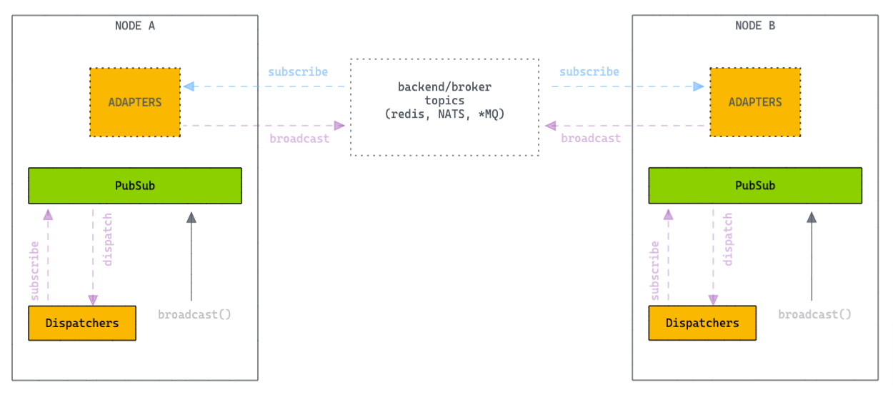

<br>
<div align="center">
    
    <p align="center">
        To create distributed systems in a simple, elegant and safe way.
    </p>    
</div>

<a href="https://github.com/syntax-framework/syntax"></a>

**chain** is part of the [Syntax Framework](https://github.com/syntax-framework/syntax)

---

Chain is a core library that tries to provide all the necessary machinery to create distributed systems in a simple,
elegant and safe way.

## Feature Overview

- Optimized HTTP Router middleware
- Realtime Publisher/Subscriber service.
- Socket & Channels: A socket implementation that multiplexes messages over channels.
- Crypto-related functionalities

## Installation

```
go get github.com/syntax-framework/chain
```

## Router


**chain** has a lightweight high performance HTTP request router (also called *multiplexer* or just *mux* for short)
for [Go](https://golang.org/). In contrast to the [default mux](https://golang.org/pkg/net/http/#ServeMux) of
Go's `net/http` package, this router supports variables in the routing pattern and matches against the request method.
It also scales better.

- Optimized HTTP router which smartly prioritize routes
- Build robust and scalable RESTful APIs
- Extensible Middleware framework
- Handy functions to send variety of HTTP responses
- Centralized HTTP error handling

```go
package main

import (
	"github.com/syntax-framework/chain"
	"log"
	"net/http"
)

func main() {
	router := chain.New()

	// Middleware
	router.Use(func(ctx *chain.Context, next func() error) error {
		println("first middleware")
		return next()
	})

	router.Use("GET", "/*", func(ctx *chain.Context) {
		println("second middleware")
	})

	// Handler
	router.GET("/", func(ctx *chain.Context) {
		ctx.Write([]byte("Hello World!"))
	})

	// Grouping
	v1 := router.Group("/v1")
	{
		v1.GET("/users", func(ctx *chain.Context) {
			ctx.Write([]byte("[001]"))
		})
	}

	v2 := router.Group("/v2")
	{
		v2.GET("/users", func(ctx *chain.Context) {
			ctx.Write([]byte("[002]"))
		})
	}

	if err := http.ListenAndServe("localhost:8080", router); err != nil {
		log.Fatalf("ListenAndServe: %v", err)
	}
}
```

### More about Router

- [Router docs](/docs/ROUTER.md)
- [`/examples/router`](/examples/router)

## PubSub



Realtime Publisher/Subscriber service.

You can use the functions in this module to subscribe and broadcast messages:

```go
package main

import (
	"fmt"
	"github.com/syntax-framework/chain"
	"github.com/syntax-framework/chain/pubsub"
	"time"
)

type MyDispatcher struct {
}

func (d *MyDispatcher) Dispatch(topic string, message any, from string) {
	println(fmt.Sprintf("New Message. Topic: %s, Content: %s", topic, message))
}

func main() {

	dispatcher := &MyDispatcher{}
	serializer := &chain.JsonSerializer{}

	pubsub.Subscribe("user:123", dispatcher)

	bytes, _ := serializer.Encode(map[string]any{
		"Event": "user_update",
		"Payload": map[string]any{
			"Id":   6,
			"Name": "Gabriel",
		},
	})
	pubsub.Broadcast("user:123", bytes)
	pubsub.Broadcast("user:123", []byte("Message 2"))

	// await
	<-time.After(time.Millisecond * 10)

	pubsub.Unsubscribe("user:123", dispatcher)

	pubsub.Broadcast("user:123", []byte("Message Ignored"))

	// await
	<-time.After(time.Millisecond * 10)
}
```

### More about PubSub

- [PubSub docs](/docs/PUBSUB.md)
- [`/examples/pubsub`](/examples/pubsub)

## Socket & Channels


A socket implementation that multiplexes messages over channels.

Once connected to a socket, incoming and outgoing events are routed to channels. The incoming client data is routed to
channels via transports. It is the responsibility of the socket to tie transports and channels together.

Chain ships with a JavaScript implementation that interacts with backend and can be used as reference for those
interested in implementing custom clients.

Server

```go
package main

import (
	"github.com/syntax-framework/chain"
	"github.com/syntax-framework/chain/socket"
	"log"
	"net/http"
)

func main() {
	router := chain.New()

	router.Configure("/socket", AppSocket)

	if err := http.ListenAndServe(":8080", router); err != nil {
		log.Fatalf("ListenAndServe: %v", err)
	}
}

var AppSocket = &socket.Handler{
	Channels: []*socket.Channel{
		socket.NewChannel("chat:*", chatChannel),
	},
}

func chatChannel(channel *socket.Channel) {

	channel.Join("chat:lobby", func(params any, socket *socket.Socket) (reply any, err error) {
		return
	})

	channel.HandleIn("my_event", func(event string, payload any, socket *socket.Socket) (reply any, err error) {
		reply = "Ok"

		socket.Push("other_event", map[string]any{"value": 1})
		return
	})
}
```

Client (javascript)

```javascript
const socket = chain.Socket('/socket')
socket.connect()

const channel = socket.channel("chat:lobby", {param1: 'foo'})
channel.join()

channel.push('my_event', {name: $inputName.value})
    .on('ok', (reply) => chain.log('MyEvent', reply))


channel.on('other_event', (message) => chain.log('OtherEvent', message))
```

### More about Socket & Channels

- [Socket & Channels docs](/socket/README.md)
- [`/examples/socket-chat`](/examples/socket-chat)

## Crypto

Simplify and standardize the use and maintenance of symmetric cryptographic keys.

Features:

- **SecretKeyBase** Solution that allows your application to have a single security key and from that it is possible to
  generate an infinite number of derived keys used in the most diverse features of your project.
- **Keyring** Allows you to enable key rotation, allowing encryption processes to be performed with a new key and data
  encrypted with old keys can still be decrypted.
- **KeyGenerator**: It can be used to derive a number of keys for various purposes from a given secret. This lets
  applications have a single secure secret, but avoid reusing that key in multiple incompatible contexts.
- **MessageVerifier**: makes it easy to generate and verify messages which are signed to prevent tampering.
- **MessageEncryptor** is a simple way to encrypt values which get stored somewhere you don't trust.

### More about Crypto

- [Crypto docs](/docs/CRYPTO.md)
- [`/examples/crypto`](/examples/crypto)

