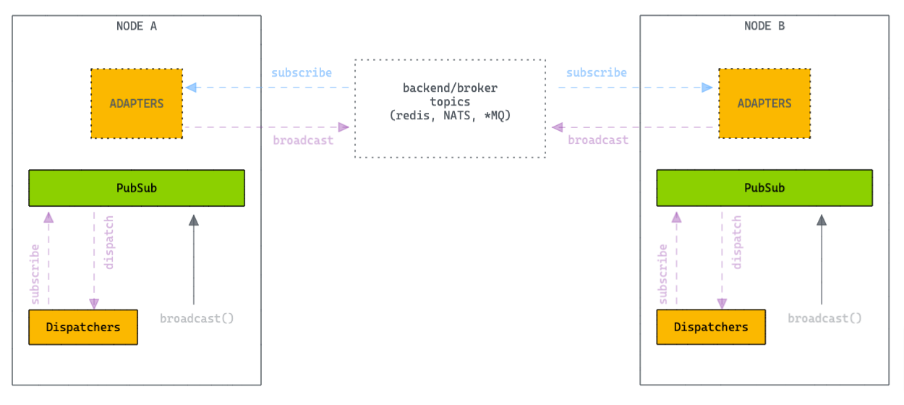
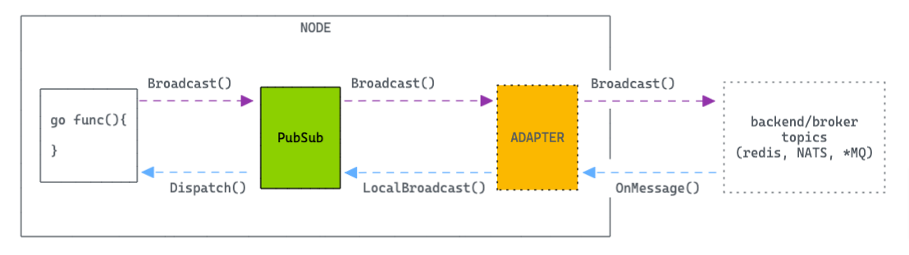

# PubSub

Realtime Publisher/Subscriber service.



You can use the functions in this module to subscribe and broadcast messages:

```go
package main

import (
	"fmt"
	"github.com/nidorx/chain"
	"github.com/nidorx/chain/pubsub"
	"time"
)

type MyDispatcher struct {
}

func (d *MyDispatcher) Dispatch(topic string, message any) {
	println(fmt.Sprintf("New Message. Topic: %s, Content: %s", topic, message))
}

func main() {

	dispatcher := &MyDispatcher{}
	serializer := &chain.JsonSerializer{}

	pubsub.Subscribe("user:123", dispatcher)

	bytes, _ := serializer.Encode(map[string]any{
		"Event": "user_update",
		"Payload": map[string]any{
			"Id":   6,
			"Name": "Gabriel",
		},
	})
	pubsub.Broadcast("user:123", bytes)
	pubsub.Broadcast("user:123", []byte("Message 2"))

	// await
	<-time.After(time.Second)

	pubsub.Unsubscribe("user:123", dispatcher)

	pubsub.Broadcast("user:123", []byte("Message Ignored"))

	// await
	<-time.After(time.Second)
}
```

## Adapters

Chain PubSub was designed to be flexible and support multiple backends.



The [`Interface`](https://github.com/nidorx/chain/blob/7e2b575140931f1ff8a50540519ec287ec5c8078/pubsub/pubsub.go#L12-L18)
of an Adapter is very simple, making it easy to implement custom adapters.

The `Subscribe(topic string)` and `Unsubscribe(topic string)` methods are invoked by PubSub ensuring that the current
instance of the application (node) receives only the messages it is interested in. The Adapter must do this control in
order to avoid unnecessary traffic on the network.

Finally, when the `Broadcast(topic string, message []byte) error` method is invoked, the adapter must deliver the
message to all nodes in the cluster (via redis for example). The Adapter should not deliver this same message to
the current node, as PubSub is responsible for local message deliveries.

When the adapter receives a message from its backend (redis for example), the adapter must invoke
the `pubsub.Dispatch(topic string, message any)` method so that PubSub can deliver the message to all dispatchers.

## API

List of methods available in the `pubsub` package

### Subscribe(topic string, dispatcher Dispatcher)


### SetAdapters(adapters []AdapterConfig)

Configure application to have instances specialized by topics.

In the example below, all messages published in the `admin:*` topics will be directed to a specific instance of
RedisAdapter.

```go
package main

import (
	"github.com/nidorx/chain/pubsub"
	"github.com/nidorx/chain-pubsub-redis"
)

func main() {
	pubsub.SetAdapters([]pubsub.AdapterConfig{
		{&RedisAdapter{Addr: "admin.redis-host:6379"}, []string{"admin:*"}},
		{&RedisAdapter{Addr: "global.redis-host:6379"}, []string{"*"}},
	})
}
```
