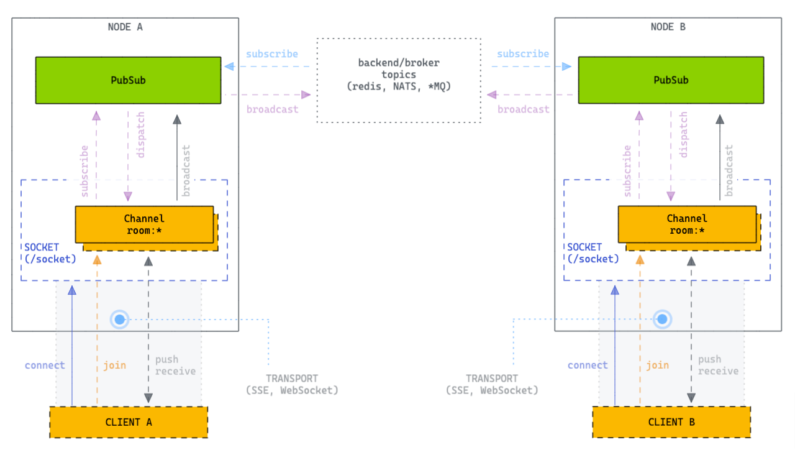
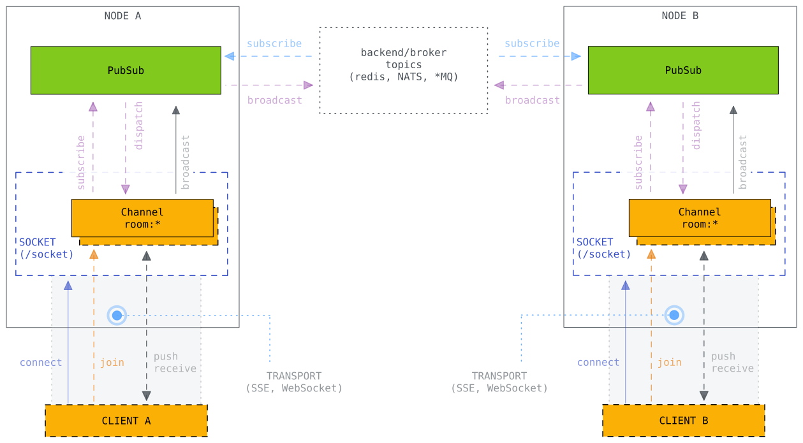

# Socket & Channels



- https://ably.com/topic/the-challenge-of-scaling-websockets

Clusterização (Horizontal Scaling)
- Não interromper os servicos
- Permitir escalar a aplicação
- Aumentar resiliencia
- Aumentar a performance
- Agrupar nós por região ou regras de negócio, reduzindo latencia para o usuário final
- Simplificar Deploy
- LOAD SHEDDING
  - Rejeitar conexões quando está chegando ao limite


Subscribing to Topics
- Somente permitir sobrescrever para tópicos específicos (não permitir *). Isso evita desperdícios de mensagens
  - Image que em todo o servidor, apenas um cliente está ouvindo o tópico "chat:555888", se o servidor sobrescrever para ouvir "chat:*", todos os outros eventos serão desperdiçados, aumentando custos e reduzindo a eficiencia da solução.
  - Para contornar isso, somente é permitido sobrescrever a tópicos específicos no pubsub, o socket faz o roteamento correto e permite a configuração de canais com wildcard internamente.

---

## Client Library



The browser client (`socket/client/chain.ts`) is a TypeScript library for real-time socket channels over SSE.

### Serving the Client

The client files are embedded in the Go binary and served automatically when a socket handler is configured:

```go
socket.ClientJsHandler(router, "/socket")
```

This registers three endpoints:

| Endpoint        | Description                     |
|-----------------|---------------------------------|
| `/socket/chain.ts`  | Raw TypeScript source           |
| `/socket/chain.js`  | Compiled JavaScript             |
| `/socket/chain.js.map` | Source map                    |

Include in your HTML:

```html
<script src="/chain.js" type="module"></script>
```

### Quick Start

```javascript
import * as chain from '/chain.js';

const socket = new chain.Socket({
    getNodes: async () => ['/socket']
});
socket.connect();

const channel = socket.channel("chat:lobby", { user: "alice" });

channel.join()
    .on('ok', () => console.log("joined"))
    .on('error', err => console.log("failed", err))
    .on('timeout', () => console.log("timed out"));

// Send
channel.push('shout', { name: 'Alice', body: 'Hello!' });

// Receive
channel.on('shout', (message) => {
    console.log(`${message.name}: ${message.body}`);
});
```

### Client Architecture

```
┌─────────────────────────────────────────────┐
│                  Browser                     │
│                                              │
│  ┌────────────┐    ┌──────────────────┐     │
│  │  Socket    │───>│  Channel(s)      │     │
│  │  (connect, │    │  (join, push,    │     │
│  │   discover │    │   on, leave)     │     │
│  │   nodes)   │    └────────┬─────────┘     │
│  └─────┬──────┘             │               │
│        │                    ▼               │
│        │             ┌──────────────┐       │
│        ▼             │  Push        │       │
│  ┌────────────┐      │  (reply,     │       │
│  │ Transport  │      │   timeout)   │       │
│  │ (SSE)      │      └──────────────┘       │
│  └────────────┘                             │
│  ┌────────────┐    ┌──────────────────┐     │
│  │  Retry     │    │  History         │     │
│  │  (backoff) │    │  (dedup window)  │     │
│  └────────────┘    └──────────────────┘     │
└─────────────────┬───────────────────────────┘
                  │ SSE + fetch POST
                  ▼
           Chain Server
```

### Key Client Features

#### Cluster Node Discovery

The client supports automatic cluster node discovery via the `getNodes` callback:

```javascript
const socket = new chain.Socket({
    getNodes: async () => {
        const res = await fetch('/api/nodes');
        const ports = await res.json();
        return ports.map(port => `http://${host}:${port}/socket`);
    },
    getNodesInterval: 30  // poll every 30 seconds
});
```

When the node list changes, the client:
1. Connects to the highest-priority node
2. Waits `dropNodeConnectionAfter` (default 5s) before closing the old connection
3. This delay handles message deduplication during the transition

#### Session Persistence

Each browser tab gets a unique socket ID (`sid`) stored in `sessionStorage`. This survives page navigations within the same tab and enables session recovery on reconnect.

#### Automatic Reconnection

Both socket and channel use exponential backoff with configurable intervals:

```javascript
const socket = new chain.Socket({
    rejoinInterval: [1000, 2000, 5000, 10000], // ms
    // ...
});
```

#### Message Deduplication

Plug in a deduplication function via the `duplicated` option. The built-in `History` class provides a sliding time window:

```javascript
const history = new chain.History(5); // 5-second window

const socket = new chain.Socket({
    getNodes: async () => ['/socket'],
    duplicated: (msg) => history.exists(msg.payload.messageId)
});
```

#### Wire Format

Messages are encoded as JSON arrays:

```
[kind, joinRef, ref, topic, event, payload]
```

Three message kinds:

| Kind      | Format                                           | Description                    |
|-----------|--------------------------------------------------|--------------------------------|
| PUSH (0)  | `[0, joinRef, ref, topic, event, payload]`       | Client → server message        |
| REPLY (1) | `[1, joinRef, ref, status, response]`            | Server → server reply          |
| BROADCAST (2) | `[2, topic, event, payload]`                  | PubSub broadcast to clients    |

### Full API Reference

See [Socket Client Documentation](../socket/client/README.md) for the complete API reference including all classes (`Socket`, `Channel`, `Push`, `TransportSSE`, `Retry`, `History`), options, and events.

### Examples

| Example                          | Description                                    |
|----------------------------------|------------------------------------------------|
| `examples/socket-chat/`          | Simple chat with single server                 |
| `examples/socket-cluster/`       | Cluster-aware client with node management UI   |